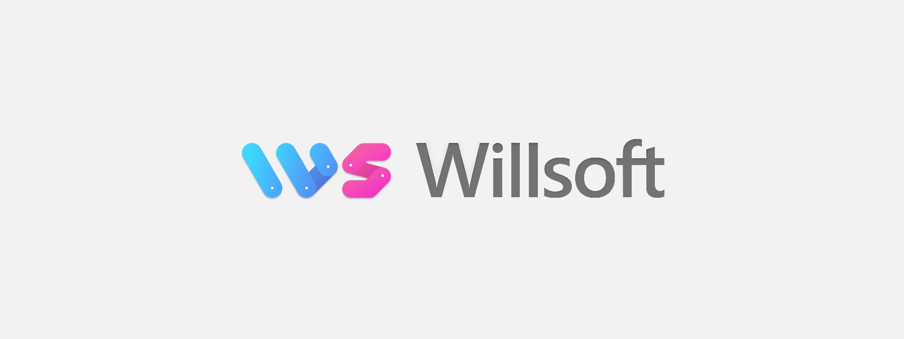

###  The official repository for the Willsoft company website.

<br/>

# Inspiration
## Layout and Design
* https://dotnet.microsoft.com/
* https://www.netguru.com/services#mobile-development

## Image resources
* https://unsplash.com/s/photos/code

## Text and pages
* https://www.xlent.se/omrade/systemutveckling
* https://www.devcore.se/itkonsult_webbutvecklare_systemutvecklare/
* https://consultingit.se/
* https://nortal.com/services/devops/
* https://doit.software/services/staff-augmentation/web-developer
* https://nexergroup.com/tech/
* https://sigma.software/
* https://www.redhat.com/en
* https://www.netguru.com/services#mobile-development

## Hero Section Parameters

Pages can define an optional hero banner via front matter parameters (no custom layout needed):

```toml
+++
title = "Services"
heroTitle = "Services"
heroLead = "Software, Web, Desktop,<br>Mobile Development and more"
heroClass = "services"          # Extra modifier class (optional)
heroButtons = [
  { text = "Our Products", href = "/products/", class = "btn btn-white btn-lg" },
  { text = "Contact Us", href = "/contact/", class = "btn btn-purple btn-lg" }
]
heroSub = "<b>The</b> company to build your apps with."
+++
```

Available fields:

* heroTitle (string) – required to render hero.
* heroLead (string, HTML allowed) – subtitle line.
* heroClass (string) – adds extra CSS class to root hero div alongside `params.heroBaseClass`.
* heroLarge (boolean) – when true, uses large hero styling. Defaults to true for index page, false for all other pages.
* heroButtons (array of objects) – each object: text, href, class.
* heroSub (string, HTML allowed) – small text under buttons.
* ogImage (string) – optional per-page Open Graph image override.

Global defaults in `hugo.toml` under `[params]`:

* heroBaseClass = "hero-default"
* googleAnalyticsID, twitterHandle, description, etc.

If a page previously had `layout = "willsoft"`, that key can now be removed – the default layout auto-renders hero conte nt.